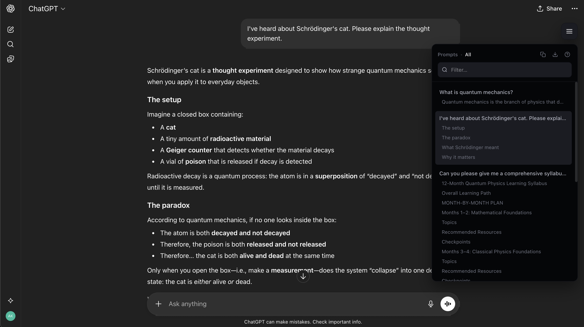
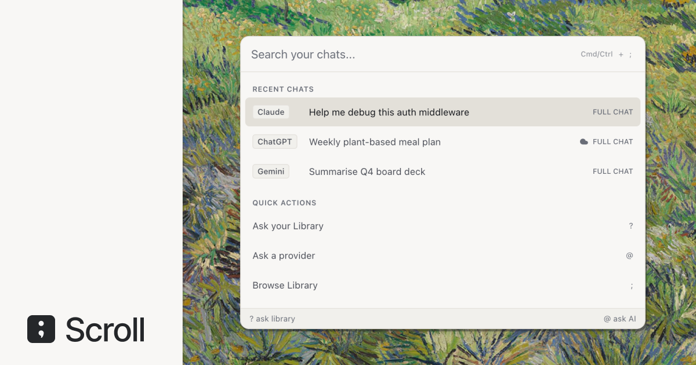

# Scroll

**Navigate, copy, and export your AI conversations.**

A browser extension that adds a navigation sidebar to ChatGPT, Claude, and Gemini. Jump to any turn, copy prompts and responses, and export full conversations.

<p align="center">
  
</p>

## Install

[**Add to Chrome**](https://chromewebstore.google.com/detail/scroll/mpcklmodkihbiblhffoganikkdfoaphe) — works on Chrome, Edge, and Brave.

### From source

```bash
git clone https://github.com/asker-kurtelli/scroll.git
cd scroll
npm install
npm run build
```

Load `dist/` as an unpacked extension in Chrome (`chrome://extensions` > Developer Mode > Load Unpacked).

For Firefox:

```bash
npm run build:firefox
```

Load `dist-firefox/` as a temporary add-on (`about:debugging` > This Firefox > Load Temporary Add-on).

## Features

**Navigate** — A floating table of contents for every conversation. Click any prompt to jump to it instantly. Headings inside long responses are detected for section-level navigation.

**Copy** — Copy individual prompts, responses, Q&A pairs, or the full chat. Toggle markdown mode for formatted output.

**Export** — Export conversations to Markdown, PDF, plain text, or JSON.

**Search** — Filter turns and headings by keyword.

**Drag** — Reposition the toggle button anywhere on screen.

## Keyboard shortcuts

| Shortcut | Action |
|----------|--------|
| `Cmd/Ctrl + ;` | Toggle sidebar |
| `Cmd/Ctrl + Shift + C` | Copy full chat |
| `Cmd/Ctrl + E` | Export chat |
| `Cmd/Ctrl + M` | Toggle markdown copy mode |
| `Cmd/Ctrl + C` | Copy focused response |
| `Cmd/Ctrl + X` | Copy focused prompt |
| `Cmd/Ctrl + Z` | Copy focused Q&A pair |
| `Arrow Up/Down` | Navigate items |

## How it works

Scroll runs as a content script on ChatGPT, Claude, and Gemini. It watches the DOM for conversation turns using a MutationObserver and renders a sidebar table of contents inside a Shadow DOM.

No data leaves your browser. No account required. No permissions beyond content script injection.

**Tech stack:** TypeScript, React, Vite, Tailwind CSS v4, Manifest V3.

## What's next

<p align="center">
  
</p>

[Get early access at tryscroll.app](https://tryscroll.app)

## Contributing

See [contributing.md](contributing.md) for guidelines.

## License

MIT — [Asker Kurt-Elli](https://x.com/askerkurtelli)
